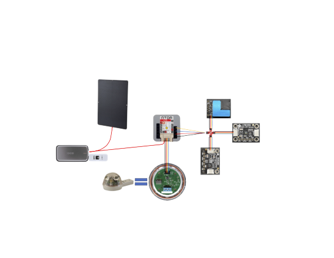

# Assembling the Main Unit

**Components:**

1. **Spherical Housing:**
     - Contains the microcontroller and primary wiring center.

2. **Radiation Shield:**
     - Contains the atmospheric sensor (BME680).

3. **UV Tube and UV Cap:**
     - Contains the LTR390.
     - Is a non-threaded 1in housing such that it can sit separate (in a T) from the orb, so UV isn't
   obstructed.

5. **AQ (Air Quality) :**
     - Contains the PMSA003I.
     - Made of three component, a base (sensor is placed there), a vented lid fastened to the base,
   and an impermeable cap (for sensor protection)

6. **Hydreon RG15 Rain Sensor:**
     - Separate it from its base by removing the four Phillips head screws.
     - Connect it to the microcontroller using GPIO to Grove wire-set with the following connections:
       - Red: 5V
       - Black: Ground
       - Yellow: Input
       - White: Output
      - Attach the threaded, printed, base that you printed.

7. **Qwiic Connection:**
     - The RG15 monopolizes the Grove port, and the type of connection that port uses.
     - To integrate Qwiic, attach a GPIO to qwiic jumper on ground, 5v, pin 21, and pin 25 of the microcontroller.
     - Connect a four-way qwiic splitter to this qwiic setup.

8. **Other Sensors:**
     - Qwiic compatible, I2C, sensors can be daisy-chained or connected to another splitter if needed.

**Assembly:**

1. Wire up the entire system and connect it to a power source and wireless signal.

2. Run diagnostics through CHORDS to ensure data is being received by clients.

3. Place each sensor in its respective housing and reattach all components.

4. Mount the sensor station at a height of 1.5-2 meters off the ground, in a representative area compared to the surrounding environment, and isolated from buildings for accurate measurements more suitable in use for climate models.

