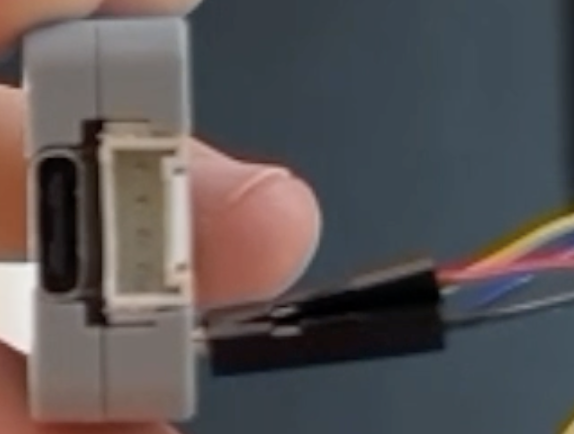
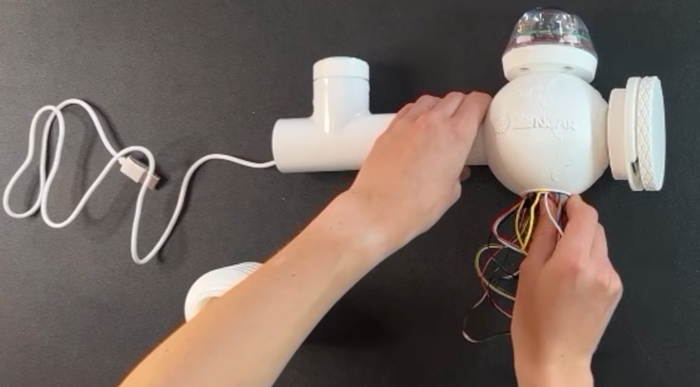

# Assembling the Main Unit
At this point you should have confirmed your sensors, wiring, microcontroller, connection, and power source are functional. Now we will disconnect the wiring we put together for testing so that we may get each component into its housing, then fit all the housing together.

The instructions on this page are to assemble a basic model of the IoT weather station with four sensors: rain gauge, air quality, temperature/pressure/humidity, and UV. We encourage you to explore and iterate on this design once you understand the principle structure. If you would like to add more sensors, any Qwiic compatible, I2C, sensors can be daisy-chained or connected to another splitter if needed.

## Housing Assembly

1. **Hydreon RG15 Rain Sensor**

     |Parts|||
     | ------ |  ------ |   ------ | 
     |Rain gauge wired with GPIO to Grove cable Screws from original rain gauge base|3D printed rain gauge mount|Screwdriver|

     |Instructions | Image|
     | ------ | ------ |
     |Detach the rain gauge from the microcontroller by pinching down on the white tab (open the alligator mouth) and pulling it off. |{: style="display: block; margin: 0 auto; width: 200px;"}|
     |Insert the cords through the center of the rain gauge base and align the base with the four screw holes in the board. Reattach the housing with the screws you removed from the manufacturer's base. Note: it is not required to keep the silica packet in. The purpose of the packet is to absorp water that may get into the sensor. | {: style="display: block; margin: 0 auto; width: 200px;"} |

2. **Air Quality Sensor Housing**

     |Parts|||
     | ------ |  ------ |   ------ | 
     |AQ Sensor wired with 200mm qwiic wire|AQ Base|AQ vented cap|

     |Instructions | Image|
     | ------ | ------ |
     |Unplug the air quality sensor from the Qwiic connector, but leave the cord connected to the sensor.|{: style="display: block; margin: 0 auto; width: 200px;"}|
     |Find the fan on the sensor (looks like a small black box). Feed the air quality wiring through the vented base and make sure the fan is facing towards the bottom of the housing (Look for the gap/lip at the bottom of the vented lid). |{: style="display: block; margin: 0 auto; width: 200px;"}|
     |Twist on the vented lid. You should be able to see the fan at the bottom of the housing. NOTE: It may be a little difficult to twist on the vented lid. You may need to snap it into place. |{: style="display: block; margin: 0 auto; width: 200px;"}|

3. **Temperature, Humidity, and Air Pressure (BME680) Housing**

     |Parts|||
     | ------ |  ------ |   ------ | 
     |BME680 wired with 100mm qwiic wire|Radiation Shield|Vented Cap|

     |Instructions | Image|
     | ------ | ------ |
     |Screw the vented cap onto the bottom of the radiation shield. |{: style="display: block; margin: 0 auto; width: 200px;"}|
     |Gently place the temperature, humidity, and air pressure sensor (BME 680) into the radiation shield with the wires sticking out from the top opening. | {: style="display: block; margin: 0 auto; width: 200px;"} |

4. **UV Sensor Housing**

     |Parts|||
     | ------ |  ------ |   ------ | 
     |UV sensor wired with 500mm qwiic wire UV cap UV tube|1" PVC T pipe Short length of 1" PVC Threaded to PVC adaptor|Lens cover Glue|

     |Instructions | Image|
     | ------ | ------ |
     |Unplug the UV sensor from the Qwiic connection port, but leave it wired to the sensor. Position the sensor in the UV cap so that the sensor-side is visible through the cap’s hole.|{: style="display: block; margin: 0 auto; width: 200px;"}|
     |Thread the sensor wires through the UV base and screw the base onto the UV cap. The sensor should feel very secure even when you tug on the wire. Double-check that the sensor-side of the UV sensor is visible from the top of the cap. |{: style="display: block; margin: 0 auto; width: 200px;"}|
     |Thread the UV sensor wire through the top of the PVC T-pipe joint and through either side. Then, fit the UV base and cap onto the top of the PVC T-pipe joint. |{: style="display: block; margin: 0 auto; width: 200px;"}|
     |Attach the shortest PVC pipe to the PVC T-pipe joint and thread the wire through.|{: style="display: block; margin: 0 auto; width: 200px;"}|
     |Attach the final UV sensor 3D printed piece, which is the threaded attachment piece, to the end of the short PVC pipe (find in Print/Key Accessories).|{: style="display: block; margin: 0 auto; width: 300px;"}|
     |Remove any film covering the screen of the UV lens. Place the lens over the top of the UV sensor housing. If it does not stay in place, consider using hot glue or another adhesive to ensure it remains secured. |{: style="display: block; margin: 0 auto; width: 200px;"}|

## Final Assembly for Base Unit
Prior to starting the final assembly, ensure that the UV sensor, air quality sensor, rain gauge, and temperature, humidity, and air pressure sensor are all inside their respective housing and the microcontroller is properly wired. 

1. **Rain Gauge Attachment**

     |Instructions | Image|
     | ------ | ------ |
     |Thread the rain gauge wire through the upper opening of the orb housing (locate the labeled section of the orb housing and make sure it is facing the correct way) and fasten the rain gauge onto the orb housing by twisting it into the threading. Ensure the wires are sticking out from the bottom opeing of the orb.| {: style="display: block; margin: 0 auto; width: 100px;"}|

2. **Air Quality Sensor Attachment**

     |Instructions | Image|
     | ------ | ------ |
     |Position the orb housing so that the “NCAR” label is visible to you. Thread the air quality sensor wires through the right-side opening and of the orb housing and out through the bottom. |{: style="display: block; margin: 0 auto; width: 100px;"}|
     Now screw on the air quality sensor to secure it. Be sure the vent section is correctly aligned at the bottom. | {: style="display: block; margin: 0 auto; width: 100px;"}|
     

3. **UV Sensor Attachment**

     |Instructions | Image|
     | ------ | ------ |
     |Thread the UV sensor wire through the opposite side of the orb housing to the air quality sensor, guiding it out through the bottom orb opening. |{: style="display: block; margin: 0 auto; width: 500px;"}
     |Align the threads of the printed PVC adaptor piece and securely twist the in place. Now you should have your UV sensor sitting in a PVC T-pipe junction and connected to the main orb with another length of PVC. Ensure you have three wires coming out the bottom of the orb: the rain gauge wire, the air quality sensor wire, and the UV sensor wire.|{: style="display: block; margin: 0 auto; width: 500px;"}

4. **Power Cord Attachment**

     |Instructions | Image|
     | ------ | ------ |
     |Insert the USB-C cord into the UV sensor's PVC pipe and through the bottom of the orb housing. Leave the USB side sticking out of the PVC pipe.|{: style="display: block; margin: 0 auto; width: 250px;"}|

5. **Connecting all the wiring**

     |Instructions | Image|
     | ------ | ------ |
     |Find the rain gauge connector and connect it into the microcontroller (look for white with 4 prongs). Then, connect the USB-C power to the microcontroller right below it.|{: style="display: block; margin: 0 auto; width: 500px;"}|
     |Connect the remaining two wires (air quality sensor and UV sensor) to the Qwiic MultiPort. The side of the port does not matter as long as the connection is tight. Attach the last sensor (BME 680 for temperature, humidity, and air pressure) to the Qwiic connection and keep track of this sensor.|{: style="display: block; margin: 0 auto; width: 200px;"}|
     |Push all the sensors into the orb housing, except for the BME 680 sensor. Leave the BME 680 sensor outside the orb housing temporarily. |{: style="display: block; margin: 0 auto; width: 200px;"}|
     |Secure the radiation shield by place the BME 680 sensor inside the shield and screwing the shield to the bottom of the orb housing.|{: style="display: block; margin: 0 auto; width: 200px;"}|
     |Once you have completed the base assembly, you can test the complete core unit. Take your power source and plug-in the USB cord. You should see multiple green lights from the air quality sensor, radiation shield, and the UV sensor. It may be helpful to dim the lights to see the green glows. You may also be able to see the orb glowing red. |{: style="display: block; margin: 0 auto; width: 200px;"}|