#Assembling Independent Power and Connection for your Station

## Solar and Power Installation for an Independent Weather Station

1. **Setting Up the Solar Panel Mounts**

     |Parts|||||
     | ------ |  ------ |   ------ |   ------ |   ------ | 
     |1” PVC pipe|2 PVC mounts with pilot holes|2 Screws|Screwdriver|Solar panel|

     |Instructions | Image|
     | ------ | ------ |
    |Pre-drill pilot holes into the outward-facing flat face of the printed PVC mounts if you have not already done so. Then, slide the PVC mounts onto the PVC.| 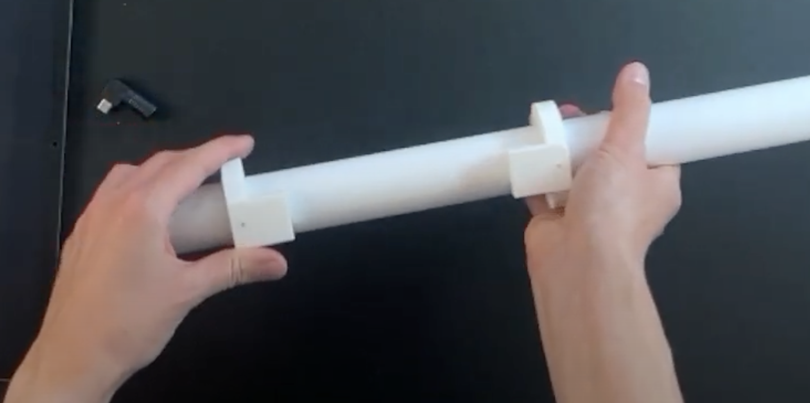{: style="display: block; margin: 0 auto; width: 200px;"}|
    |Align one screw hole on the solar panel with the pilot hole on the PVC mount and screw it on. Do the same on the other side.| 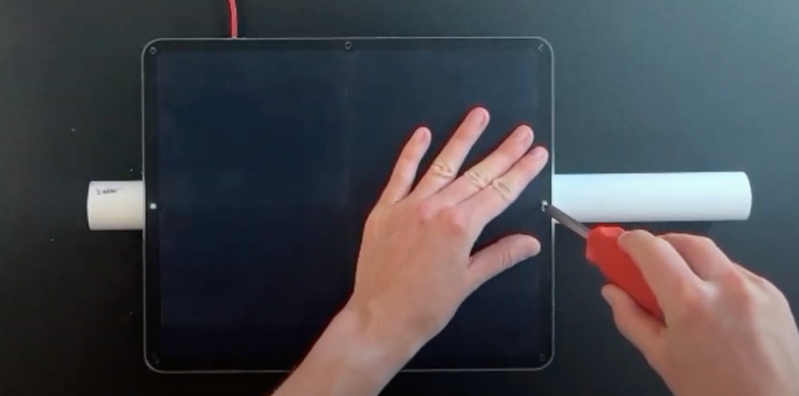{: style="display: block; margin: 0 auto; width: 200px;"} |
    |Slide the solar panel off of the PVC pipe and set aside. If it is hard to slide off, try loosening the screws.| {: style="display: block; margin: 0 auto; width: 200px;"} |

2. **Wiring the Junction Box**

     |Parts|||
     | ------ |  ------ |   ------ |
     |Wifi modem Junction box USB to USB connector|USB-C to USC power cord (already wired to microcontroller) Solar panel Solar panel adaptor|Screwdriver Battery|

     |Instructions | Image|
     | ------ | ------ |
     |Plug your USB wifi modem into your USB to USB adaptor. This will allow the modem fit better into the junction box when the time comes. Set aside.|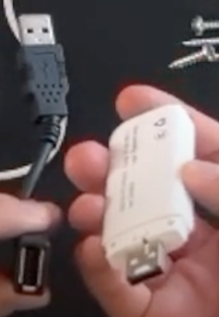{: style="display: block; margin: 0 auto; width: 200px;"}|
     |Unscrew the lid to your junction box and the cap of the hole drilled into the junction box. Run the USB end of the USB-C to USB Power cord into the box, feeding it through the cap you unscrewed from the hole in the junction box. If your hole is too small to fit the USB end, you may have to unplug the USB-C end from the microcontroller and feed it through the junction box's hole from the inside. If you do this, wait to reconnect the cord to the microcontroller. until you have finished installing your junction box.|{: style="display: block; margin: 0 auto; width: 200px;"}|
     |Feed the solar panel cord from outside the box, in, going through the cap and the hole. Once inside, plug the end of the solar panel cord into the provided adaptor. Make sure it is a tight fit.|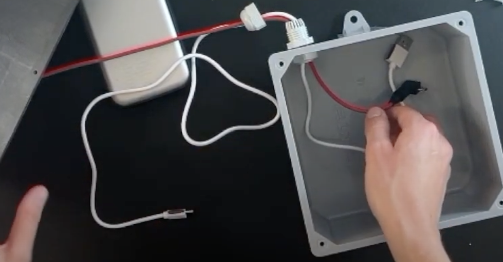{: style="display: block; margin: 0 auto; width: 200px;"}|
     |Re-screw cap over the hole into the junction box.|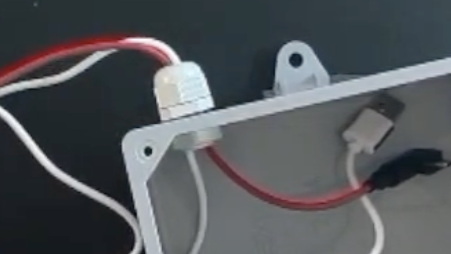{: style="display: block; margin: 0 auto; width: 200px;"}|
     |Plug your hotspot and power cord into the USB ports of your battery. You will need to use the adapter for the power cord. Plug your solar cord into the side of the battery in the appropriate port.|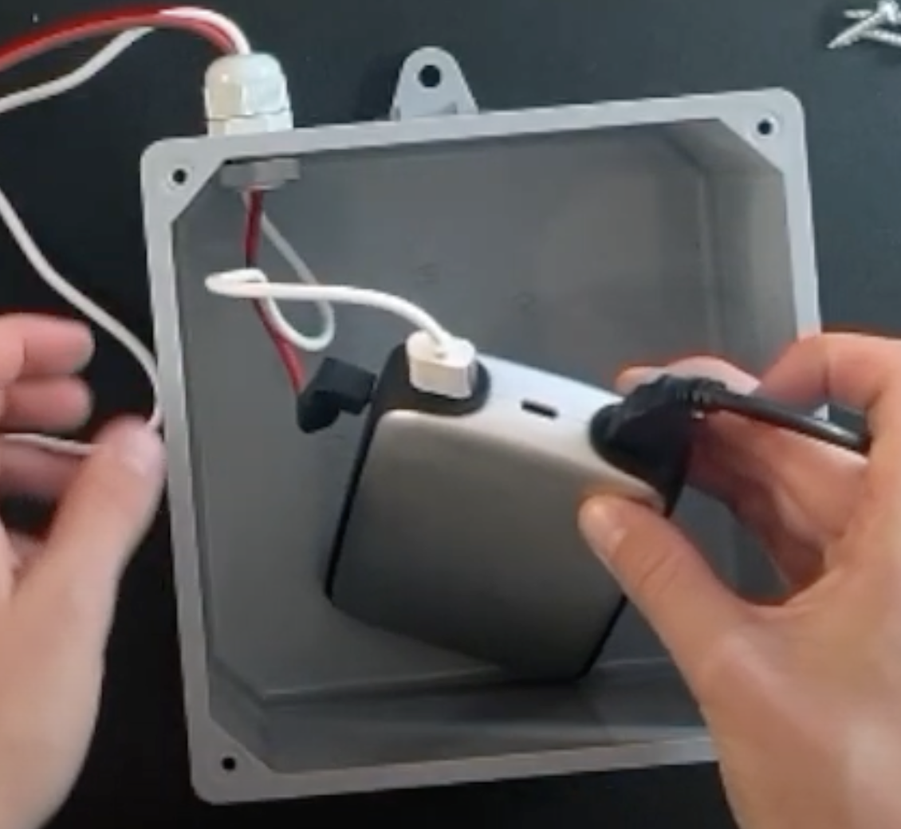{: style="display: block; margin: 0 auto; width: 200px;"}|
     |Push all contents of your junction box inside so they are below the top of the box. Tuck any excess cord length into the box. Align the junction box lid with the junction box and screw in into place.|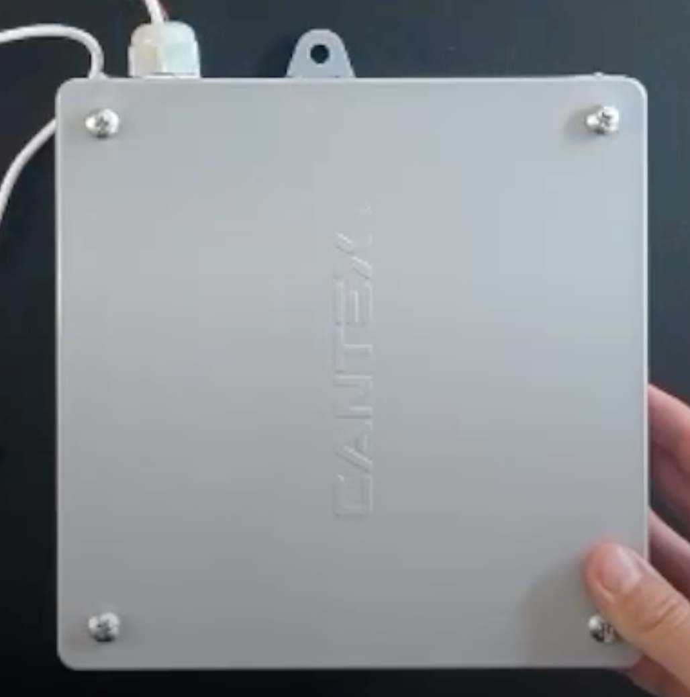{: style="display: block; margin: 0 auto; width: 200px;"}|

3. **Setting Up the Junction Box Mounts**

    |Parts|||||
    | ------ |  ------ |   ------ |  ------ |   ------ |
    |Wired junction box|1" PVC pipe|2 PVC mounts with pilot holes|2 Screws|Screwdriver

    |Instructions | Image|
    | ------ | ------ |
    |Pre-drill pilot holes into the outward-facing flat face of the printed PVC mounts if you have not already done so. Then, slide the PVC mounts onto the PVC.| {: style="display: block; margin: 0 auto; width: 200px;"}|
    |Align one screw hole on the junction box with the pilot hole on the PVC mount and screw it on. Do the same on the other side.|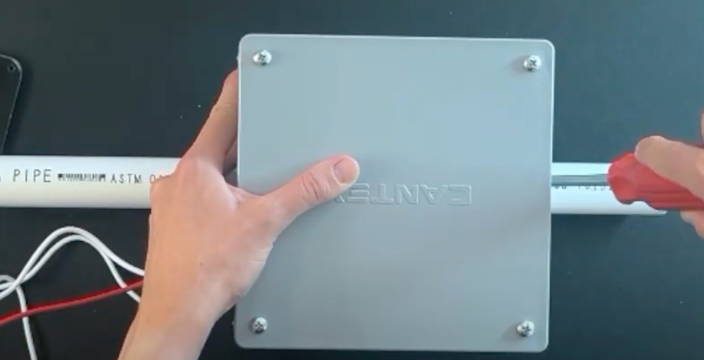{: style="display: block; margin: 0 auto; width: 200px;"}|
    |Slide the junction box off of the PVC pipe and set aside. If it is hard to slide off, try loosening the screws.|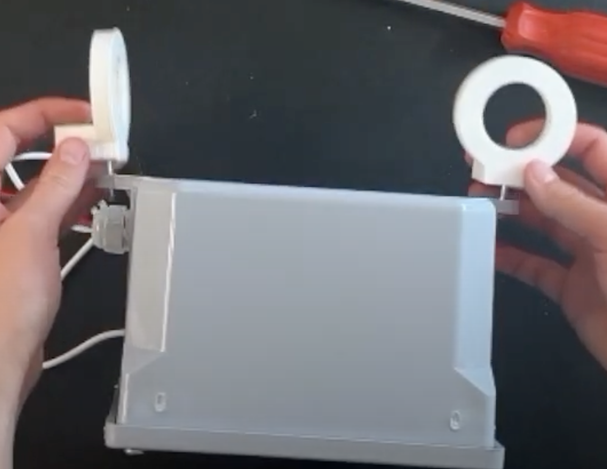{: style="display: block; margin: 0 auto; width: 200px;"}|

4. **Solar and Junction Box Installation**

    |Parts|||||
    | ------ |  ------ |   ------ |  ------ |   ------ |
    |Wired junction box with mounts|Solar panel with mounts|1” PVC pipe|Screwdriver|

    |Instructions | Image|
    | ------ | ------ |
    |Slide the **first** mount for the solar panel onto the PVC pipe. Then, slide **first** mount for the junction box onto the PVC pipe with the junction box resting on the opposite side as the solar panel. The first mount for the junction box should be on the opposite side of the hole where the wiring exits. |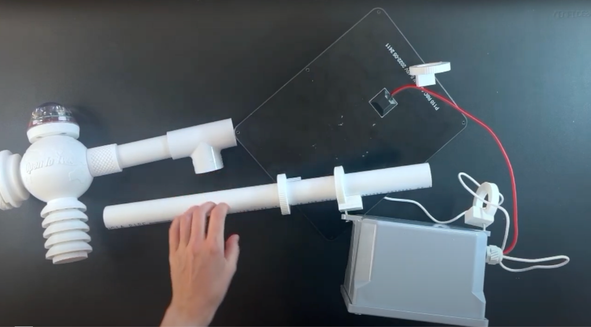{: style="display: block; margin: 0 auto; width: 500px;"}|
    |Now slide on the **second** solar mount, then the **second** junction box mount. Feed the USB-C end of the power cable into and through the PVC, coming out on the side of the pipe that will be closest to the core unit once fully assembled. You will need to disconnect the USC-C end of the power cable from the microcontroller to complete this step if you have not done so already.|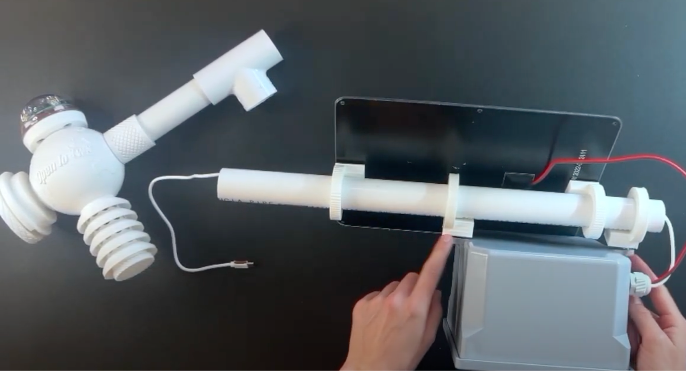{: style="display: block; margin: 0 auto; width: 500px;"}|
    |Once you have the solar panel and junction box exactly where you want them, tighten the screws on their mounts. |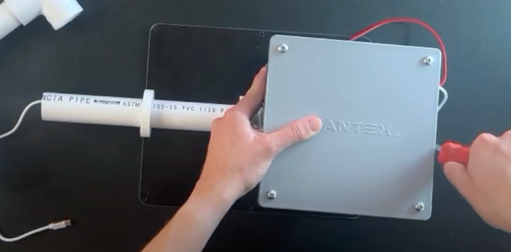{: style="display: block; margin: 0 auto; width: 500px;"}|

5. **Final Assembly**

     **Note: Exactly how you execute your final assembly will depend in part of how you plan to deploy your weather station. Consider if you want to place it on a pole in the ground or attach it to something like a fence. You will want to configure your mounting to match your intended mounting area.**

    |Parts||
    | ------ |  ------ |
    |PVC pipe with mounted Solar and Juntion Box PVC pipe|Completed Core Weather Station UV addition to Station|

    |Instructions | Image|
    | ------ | ------ |
    |If you would like your UV sensor to sit if a different position than it did during core unit assembly, reposition it now. Be sure to run the wire for the sensor back into the Qwiic multiport if you adjust the sensor's position.|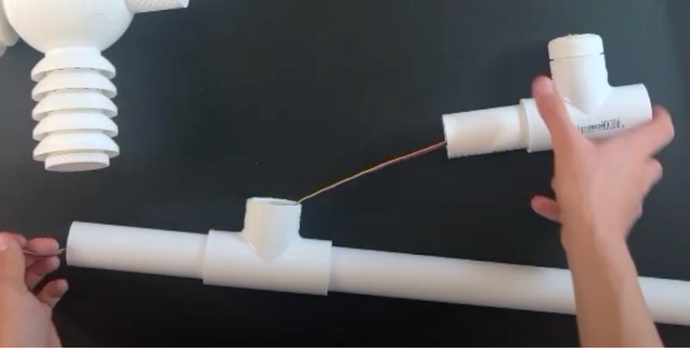{: style="display: block; margin: 0 auto; width: 200px;"}|
    |Run the power cord from where it emerged out of the power/solar pipe into the microcontroller in the core weather station|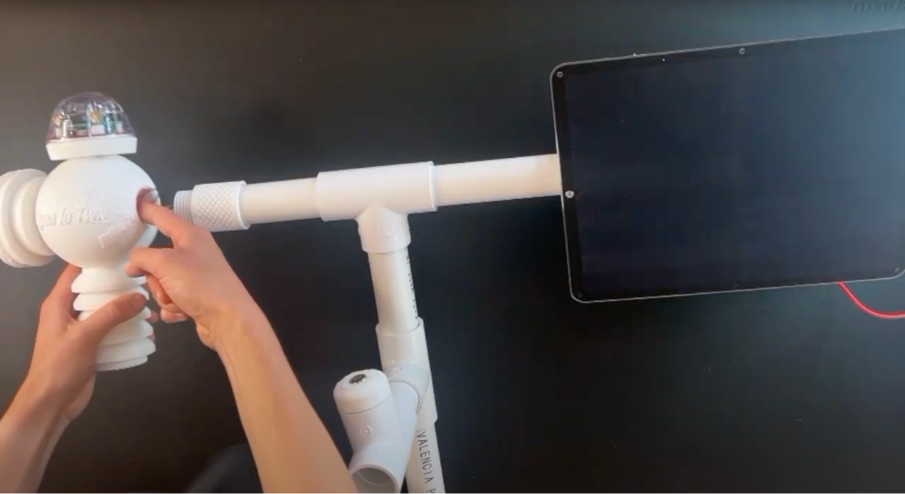{: style="display: block; margin: 0 auto; width: 200px;"}|
    |Add whatever PVC configuration you need to mount your weather station. In this case, the station will be mounted on a pole into the ground, so a long PVC pipe is added extending downward.|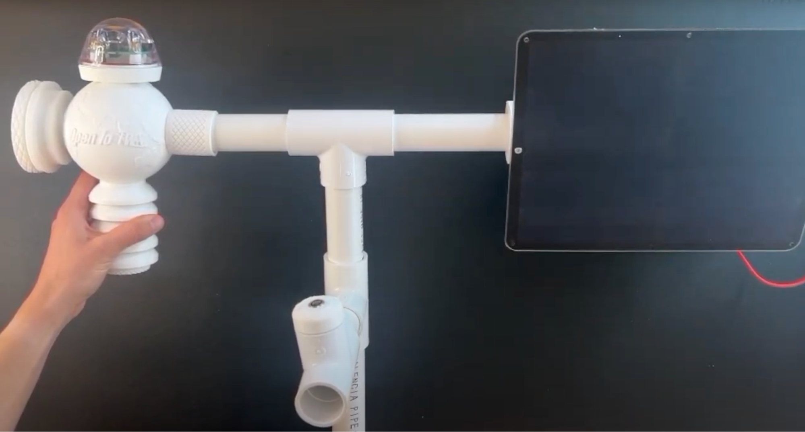{: style="display: block; margin: 0 auto; width: 200px;"}|
    
    Your weather station is complete and ready for deployment!

