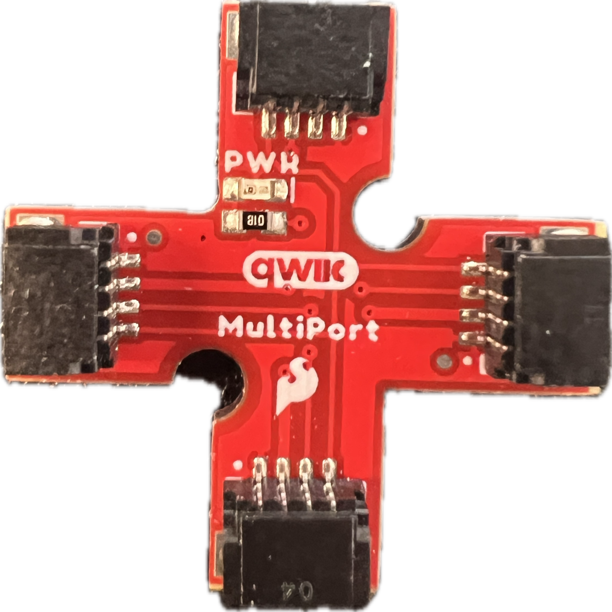
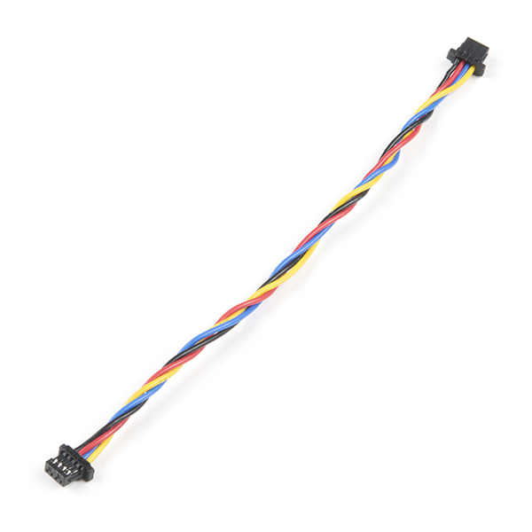
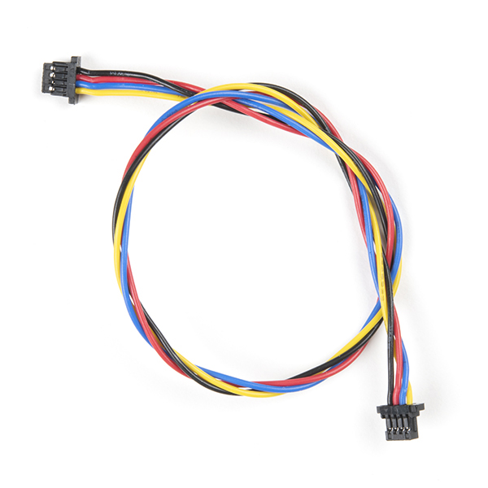
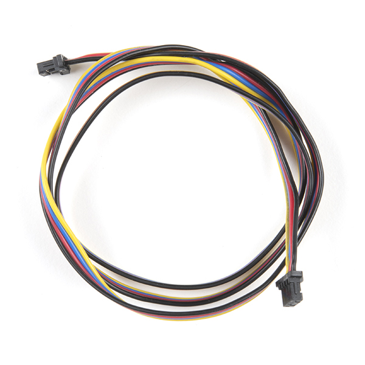
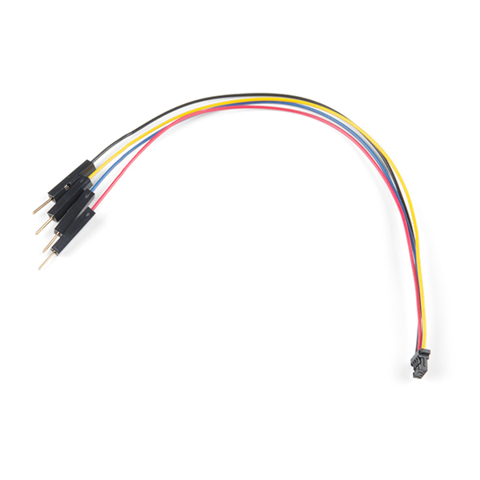
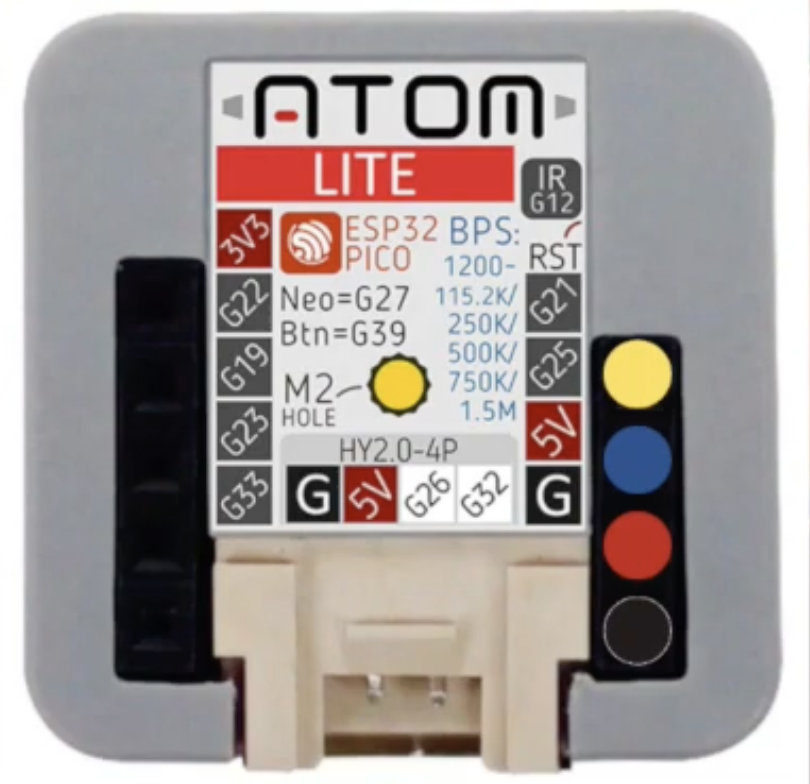
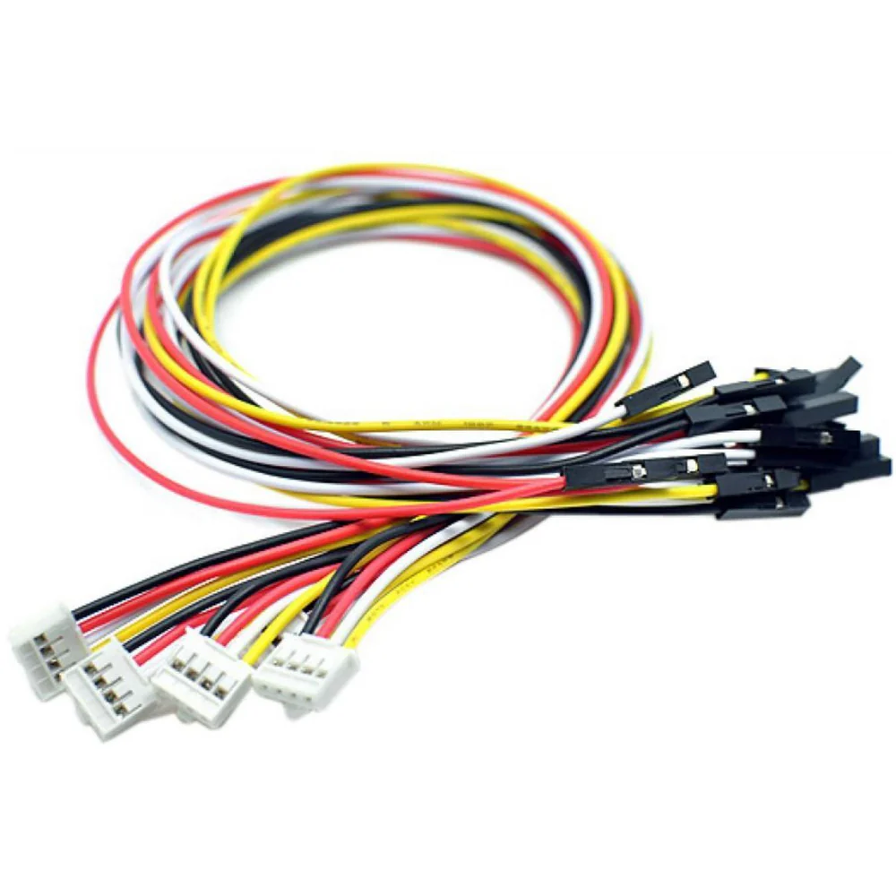
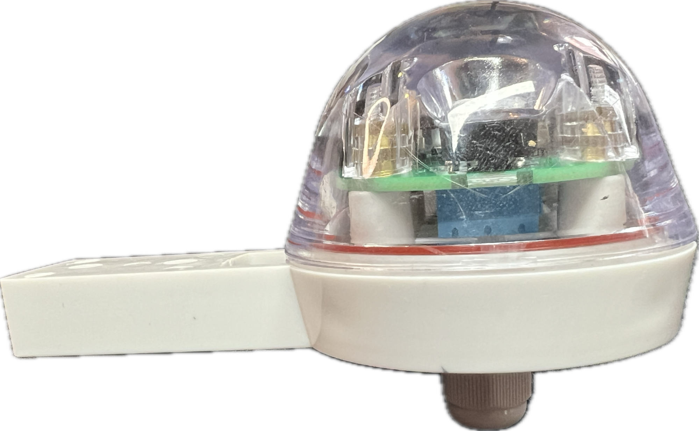
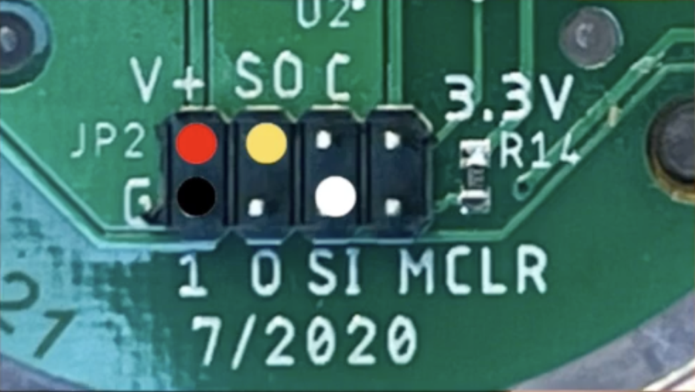
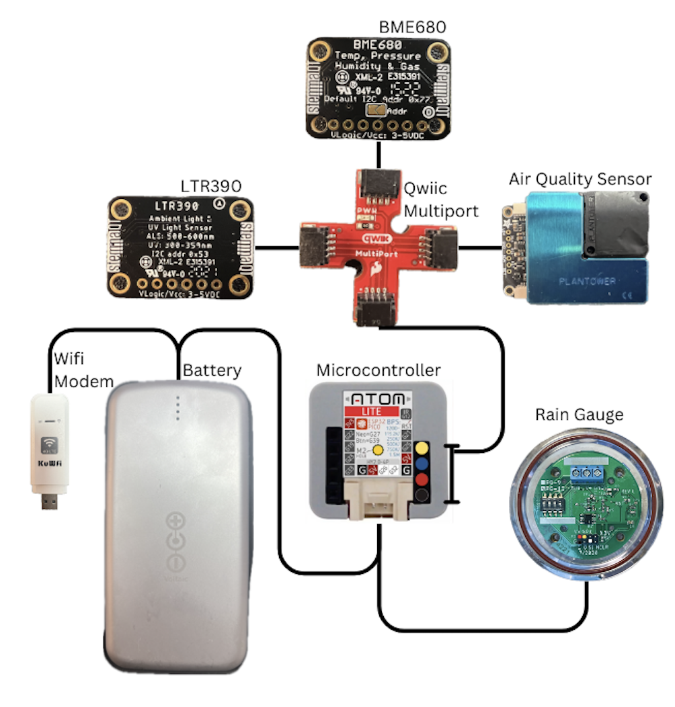

# Testing your Station Before Deployment 

Before you place all of your sensors into their various housing, it is important to test whether or not you are receiving data.

Here are the steps to do that most effectively:

1. Configure your wifi modem (if you are using a sim card setup)
2. Plug the modem into your power source and check whether or not you have a signal.
3. Unplug the modem and plug in your microcontroller, without any sensors attached. When connected to power, but not to sensors, it will blink red. 
4. Unplug the microcontroller from the power source and attach all your sensors with the appropriate cables. See the Microcontroller, Sensor, and Power Connections table below for details. 
5. Make sure all Grove and Qwiic connectors are properly pushed into place as this can cause issues down the line.
6. Without plugging in the modem, connect your microcontroller, with sensors attached, to the power source. If it flashes blue, you're clear to proceed.
7. Unplug the microcontroller, plug in the modem, wait a few seconds for your modem to connect, and plug in your microcontroller.
8. Wait a few minutes and then check your data portal to see if you are receiving data. If so, you are good assemble the station.

#### Microcontroller, Sensor, and Power Connections
|Connecting Items|Item 1 Image|Wire|Item 2 Image|Details|
|---|---|---|---|---|
|Qwiic MultiPort to BME680|{: style="display: block; margin: 0 auto; width: 100px;"}|{: style="display: block; margin: 0 auto; width: 200px;"}100mm qwiic to qwiic wire|{: style="display: block; margin: 0 auto; width: 100px;"}||
|Qwiic MultiPort to Air Quality Sensor|{: style="display: block; margin: 0 auto; width: 100px;"}|{: style="display: block; margin: 0 auto; width: 200px;"}200mm qwiic to qwiic wire|{: style="display: block; margin: 0 auto; width: 100px;"}||
|Qwiic MultiPort to UV Sensor|{: style="display: block; margin: 0 auto; width: 100px;"}|{: style="display: block; margin: 0 auto; width: 200px;"}500mm qwiic to qwiic wire|{: style="display: block; margin: 0 auto; width: 100px;"}||
|Qwiic Multiport to Microcontroller|{: style="display: block; margin: 0 auto; width: 100px;"}|{: style="display: block; margin: 0 auto; width: 200px;"}qwiic to male GPIO wire|{: style="display: block; margin: 0 auto; width: 100px;"}|{: style="display: block; margin: 0 auto; width: 100px;"}To integrate Qwiic, attach a GPIO to qwiic jumper on ground, 5v, pin 21, and pin 25 of the microcontroller. That is yellow, blue, red, black from top to bottom on the right.|
|Microcontroller to Rain Gauge|{: style="display: block; margin: 0 auto; width: 100px;"}|{: style="display: block; margin: 0 auto; width: 200px;"}grove to female GPIO wire|{: style="display: block; margin: 0 auto; width: 100px;"}|{: style="display: block; margin: 0 auto; width: 150px;"}Unscrew the base from the rain gauge. Connect the female GPIO wires as indicated. Red (5v, top left), Black(ground, bottom left), Yellow (Input, 2nd from top left), White (Output, 3rd from bottom left).|
|Microcontroller to Power|{: style="display: block; margin: 0 auto; width: 100px;"}|USB-C to any power source|Power Source||

####Wiring Diagram
{style="display: block; margin: 0 auto; width: 400px;"}

