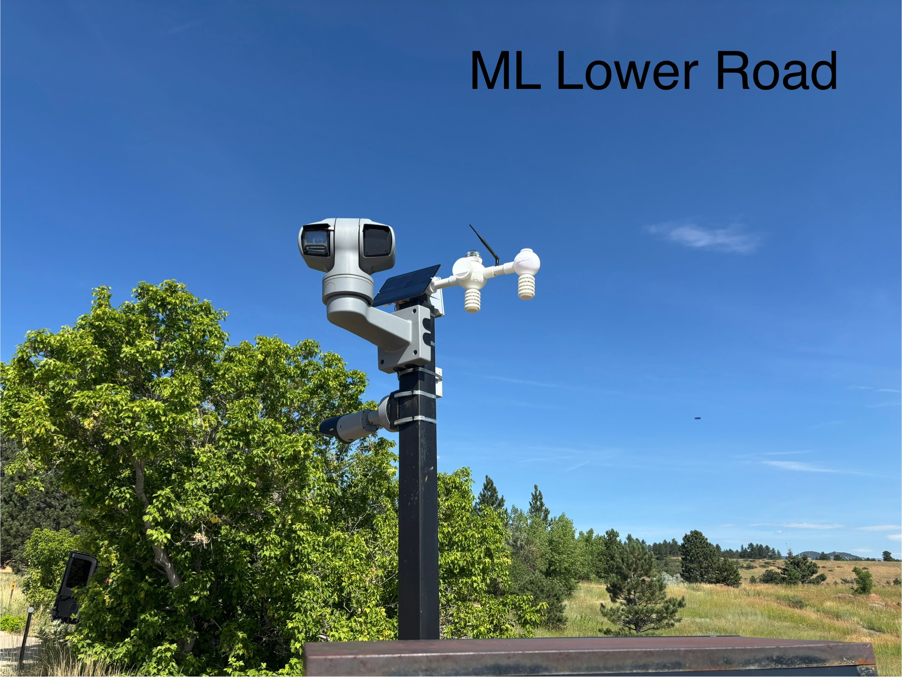
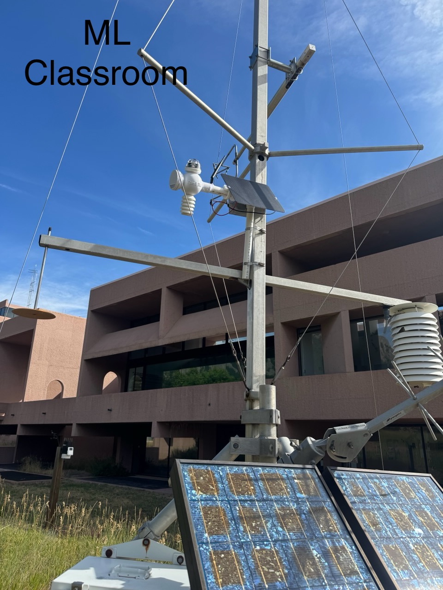
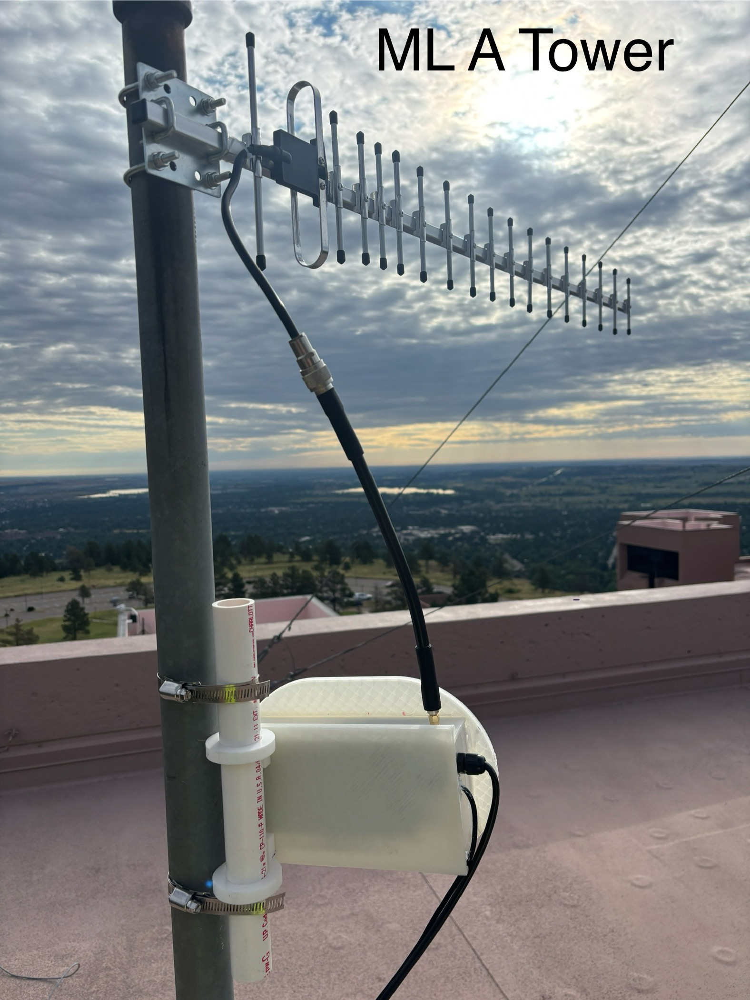
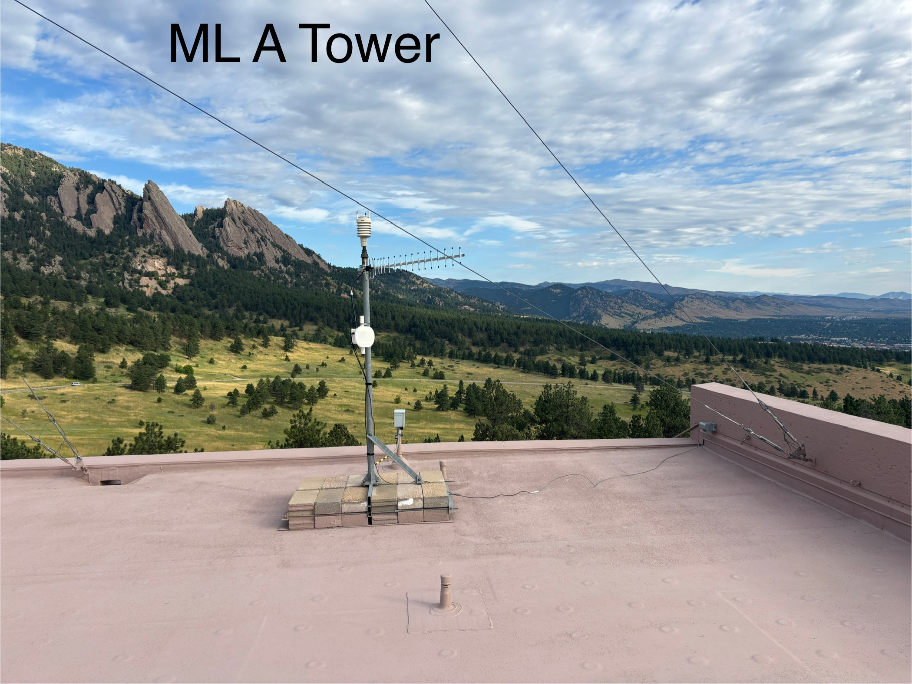
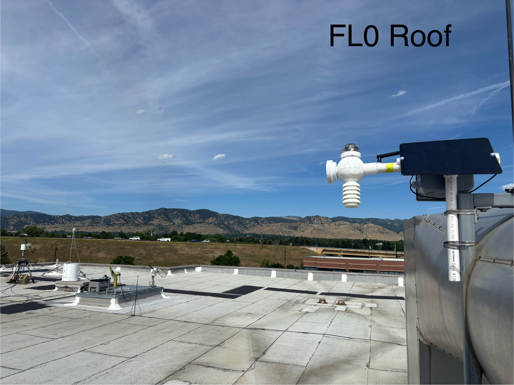
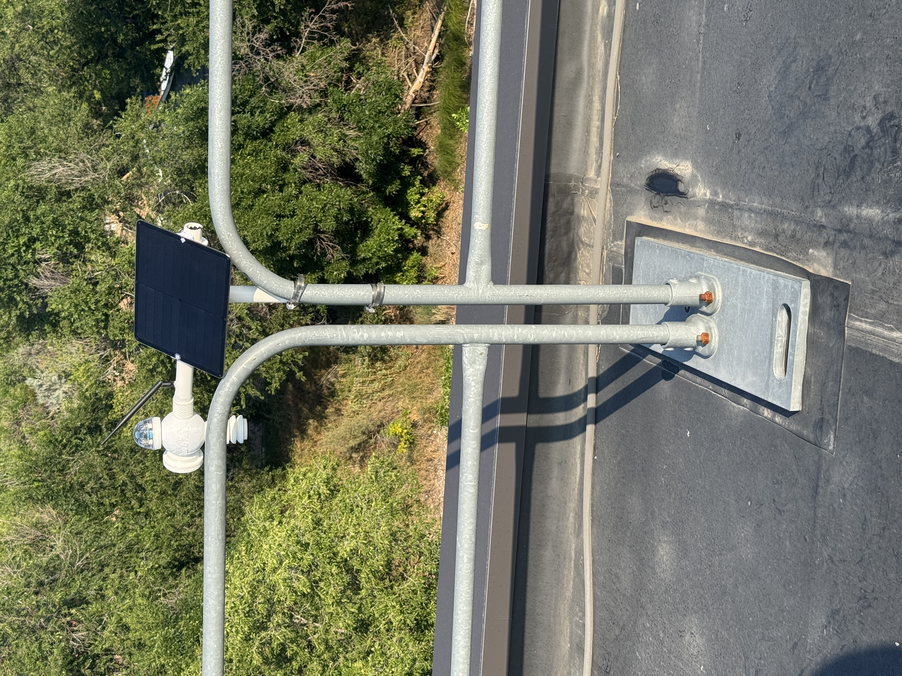
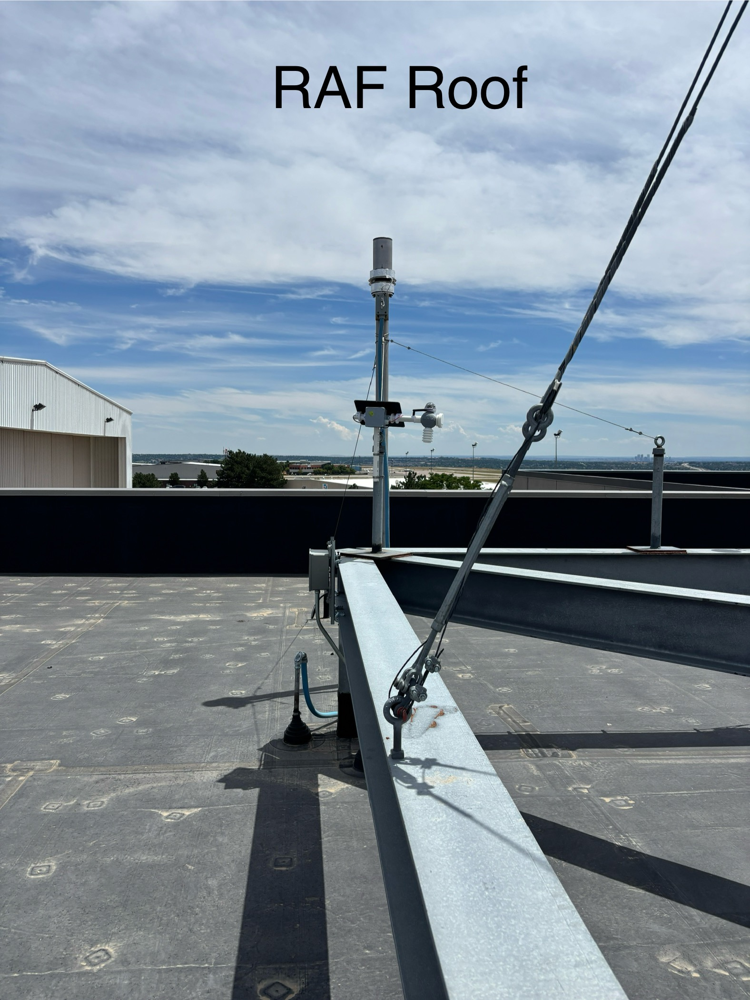
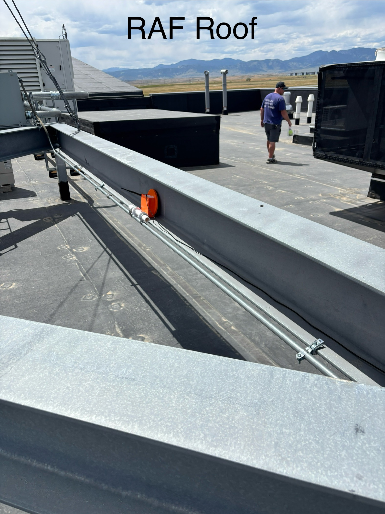
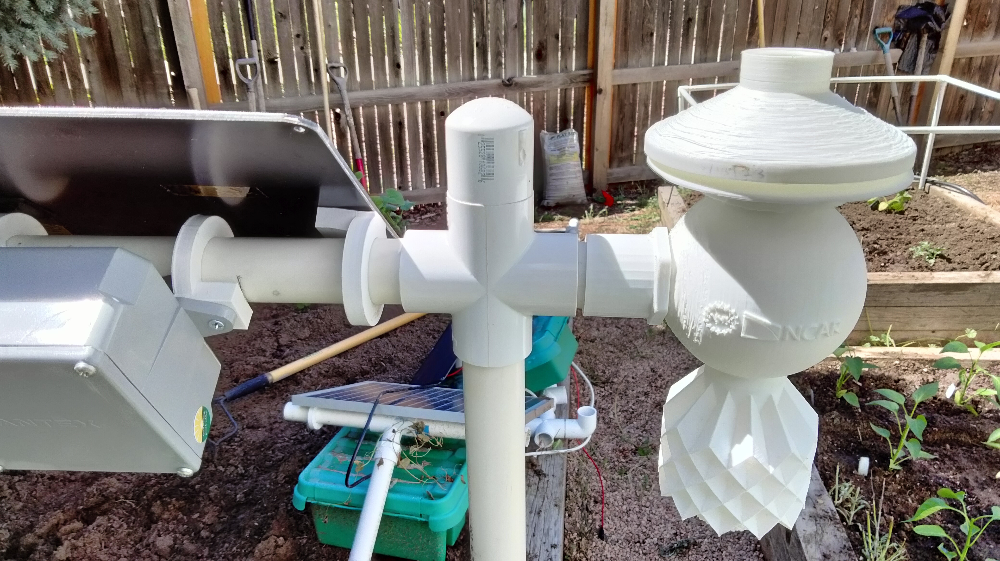

Properly situating a weather station in the field requires careful consideration for accurate data collection. When selecting a location, keep in mind a few important factors. 

* Place the weather station away from obstacles like tall trees or buildings that can disrupt airflow and affect wind measurements.
* Avoid areas with artificial heat sources such as asphalt or concrete, as they can cause higher temperature readings. 
* Also, make sure to position the station on stable ground to prevent measurement errors and ensure equipment stability.
* Mount the station at a suitable height, typically 1.5 to 2 meters above the ground, for reliable data.
* For LoRA Gateway Deployment, mount gateways at structural or geographic high point to maximize line of sight distance (i.e. roof, attic window, hilltop)
* For LoRA deployments, review antenna specifications for orientation to maximize signal. 

{style="display: block; margin: 0 auto; width: 400px;"}
{style="display: block; margin: 0 auto; width: 400px;"}
{style="display: block; margin: 0 auto; width: 400px;"}
{style="display: block; margin: 0 auto; width: 400px;"}
{style="display: block; margin: 0 auto; width: 400px;"}
{style="display: block; margin: 0 auto; width: 400px;"}
{style="display: block; margin: 0 auto; width: 400px;"}
{style="display: block; margin: 0 auto; width: 400px;"}
{style="display: block; margin: 0 auto; width: 400px;"}
{style="display: block; margin: 0 auto; width: 400px;"}
{style="display: block; margin: 0 auto; width: 400px;"}

<!-- jfslhohshofsd -->
