# Printing out the station

Attached in this document are all of the .stl (3d printing files) for the various housing components.

While we didn't feel it made sense to share gcodes for the various printing operations, here are some thoughts for settings:

1. Stay fairly near manufacturers' suggestions for bed and nozzle temperatures unless you are a seasoned 3D printer.
2. Lower support densities and/or use tree supports to save material, limit post-processing, and increase print quality.
3. Print multiple parts at once. It saves time.
4. Print the cap and lid lock for air quality sideways, it'll increase quality significantly.
5. Print the orb housing with tree supports so that the top threading forms correctly.

## Base Unit

|Name|Image|STL File|Notes|
|---|---|---|---|
|Orb Housing|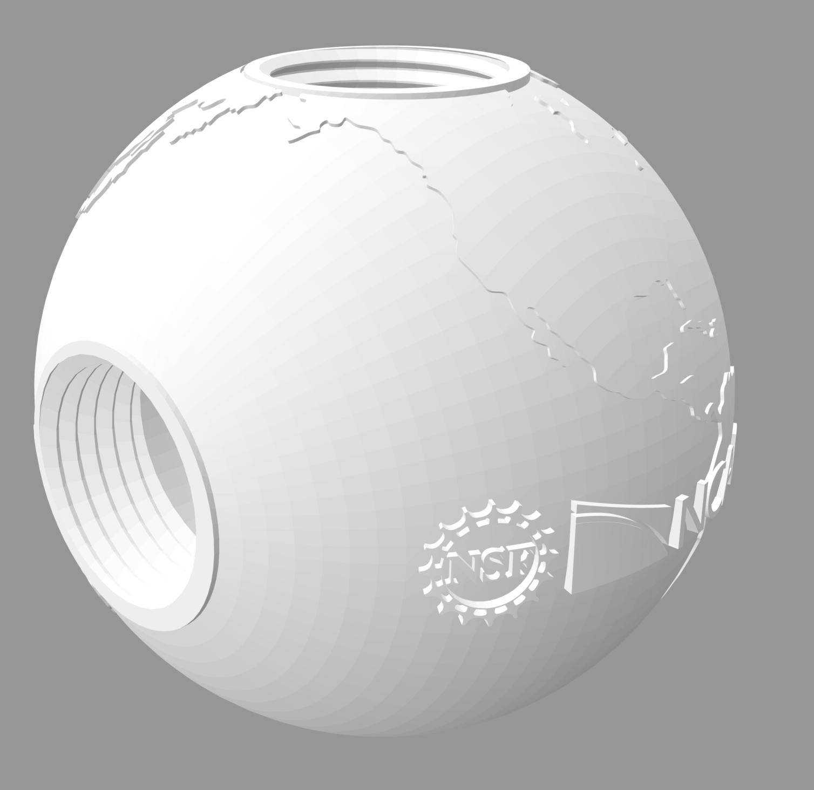{: style="display: block; margin: 0 auto; width: 300px;"}|[Orb Housing STL File](./print_files/sphere_housing/Sphere_Housing.stl)|This is the base of the weather station, where the microcontroller and most wires will go.|

## Base Attachments

|Name|Image|STL File|Notes|
|---|---|---|---|
|Rain Gauge|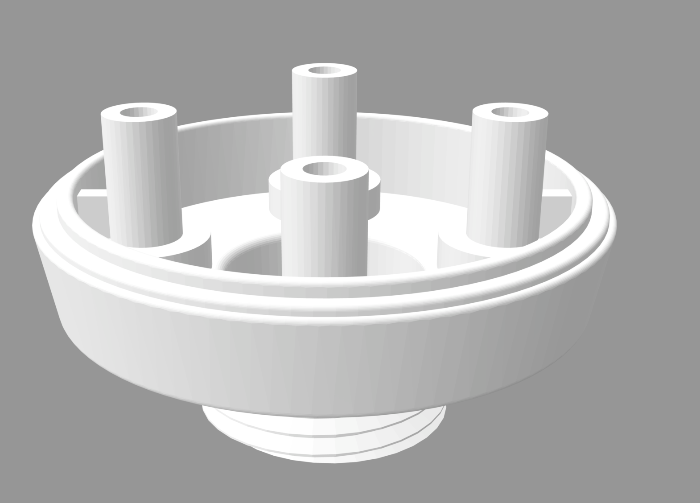{: style="display: block; margin: 0 auto; width: 400px;"}|[Rain Gauge STL File](./print_files/rain_gauge/RG15_Housing.stl)|This will replace the manufacturers rain gauge base so the gauge can screw into the orb housing.|
|UV Tube|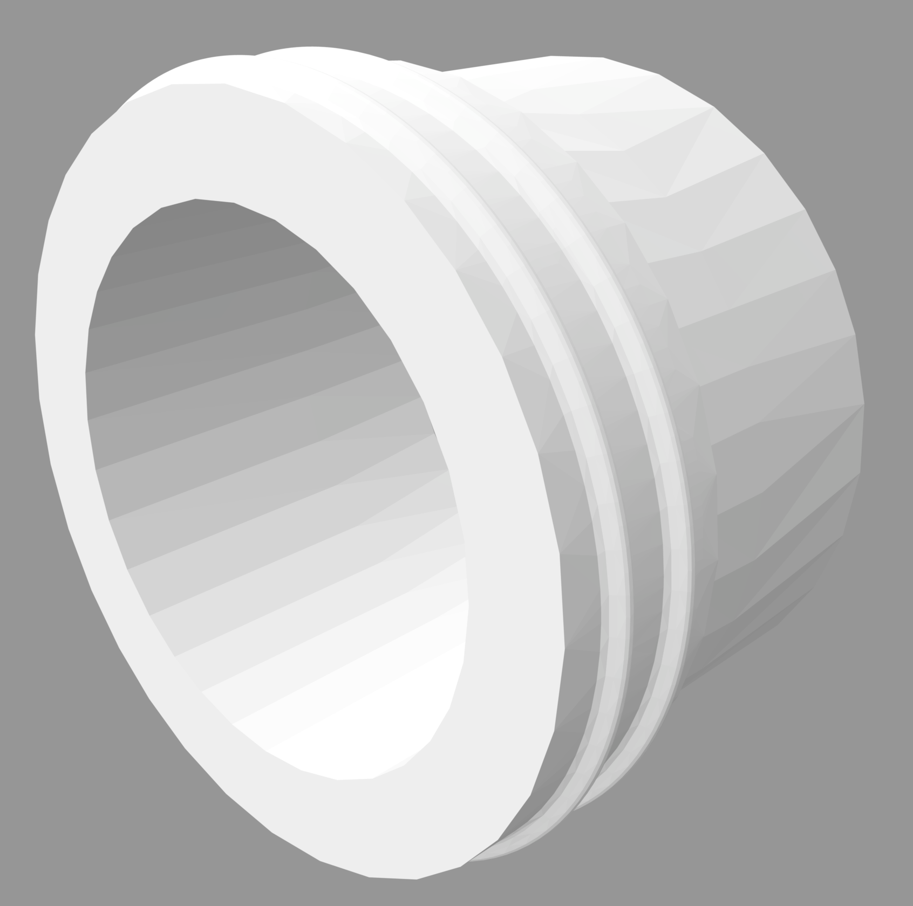{: style="display: block; margin: 0 auto; width: 400px;"}|[UV tube STL File](./print_files/uv/UV_tube.stl)| This will screw into the UV Cap to hold the UV sensor in place and allow it to fit into PVC housing.|
|UV Cap|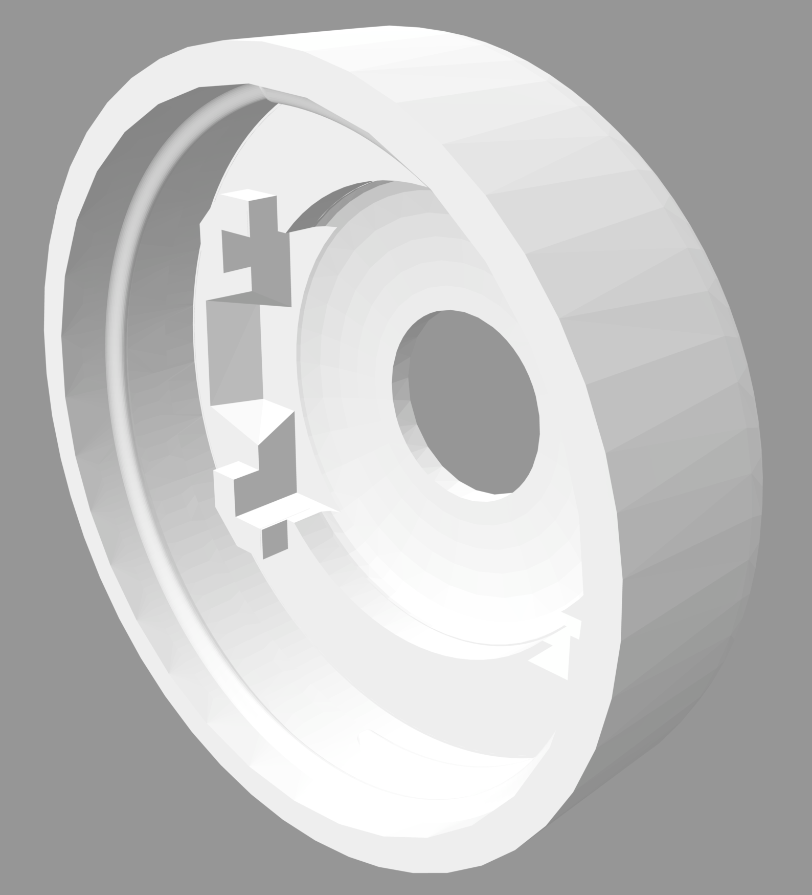{: style="display: block; margin: 0 auto; width: 400px;"}|[UV Cap STL File](./print_files/uv/UV_Cap.stl)| The UV sensor will sit inside the fitted corners of this cap and be held in place by the UV tube.|
|Radiation Shield|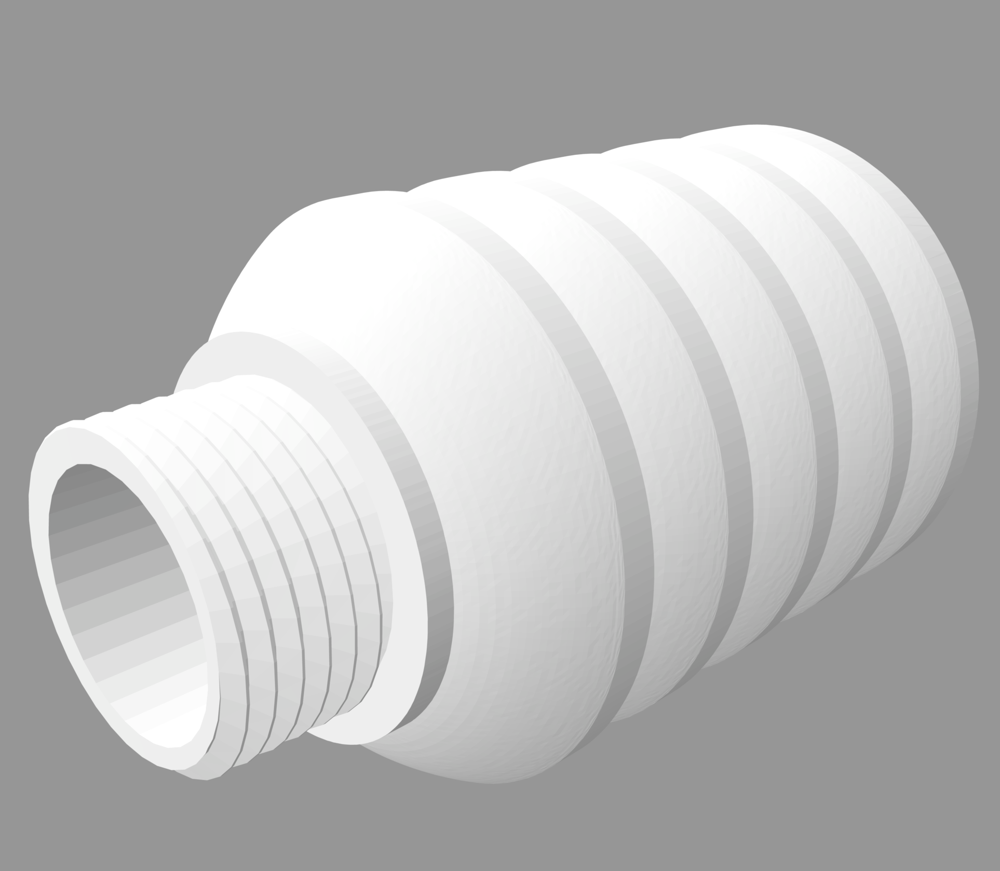{: style="display: block; margin: 0 auto; width: 400px;"}|[Radiation Shield STL File](./print_files/radiation_shield/Radiation_Shield.stl)|The bottom opening of this shield is threaded so another part can be screwed into it. In a simple station this would likely mean the vented cap (see key accessories).|
|Air Quality Body|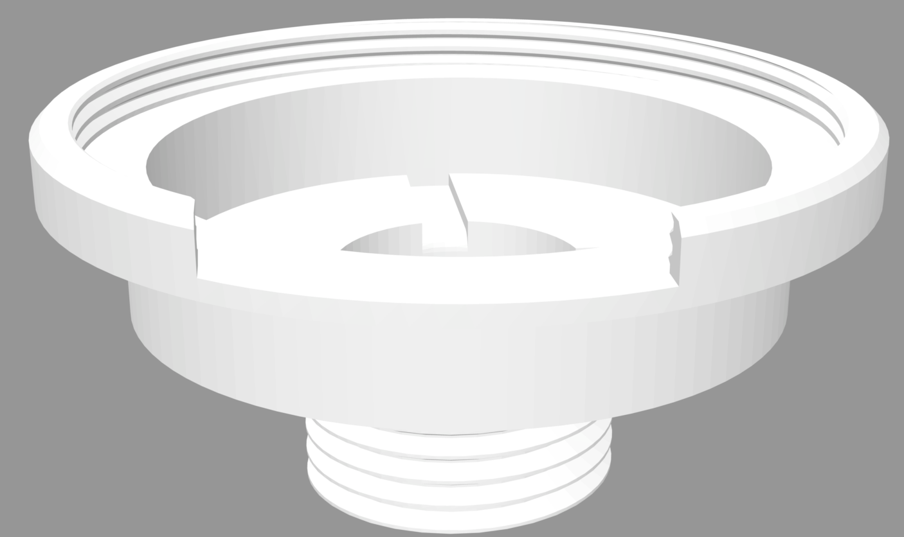{: style="display: block; margin: 0 auto; width: 400px;"}|[Air quality lid lock STL File](./print_files/air_quality/AQ_Lid_Half_Vented.stl)|Be sure the gap on the rim of this part faces downward during assembly so water cannot get into the sensor.|
|Air Quality Cap|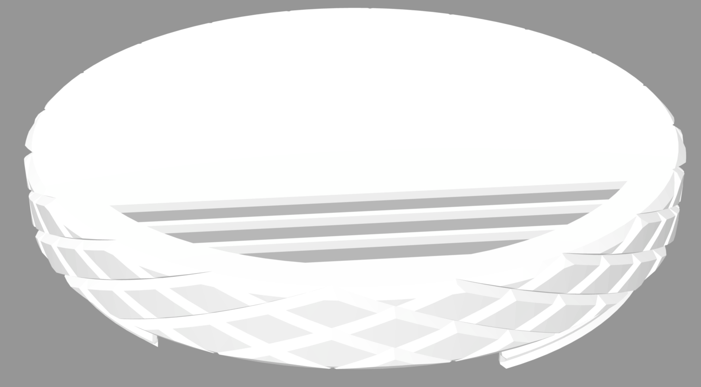{: style="display: block; margin: 0 auto; width: 400px;"}|[Air quality lid lock STL File](./print_files/air_quality/AQ_Lid_Half_Vented.stl)| Be sure the vented openings face downwards during assembly so water cannot get into the sensor.|

## Key Accessories
|Name|Image|STL File|Notes|
|---|---|---|---|
|Closed Cap|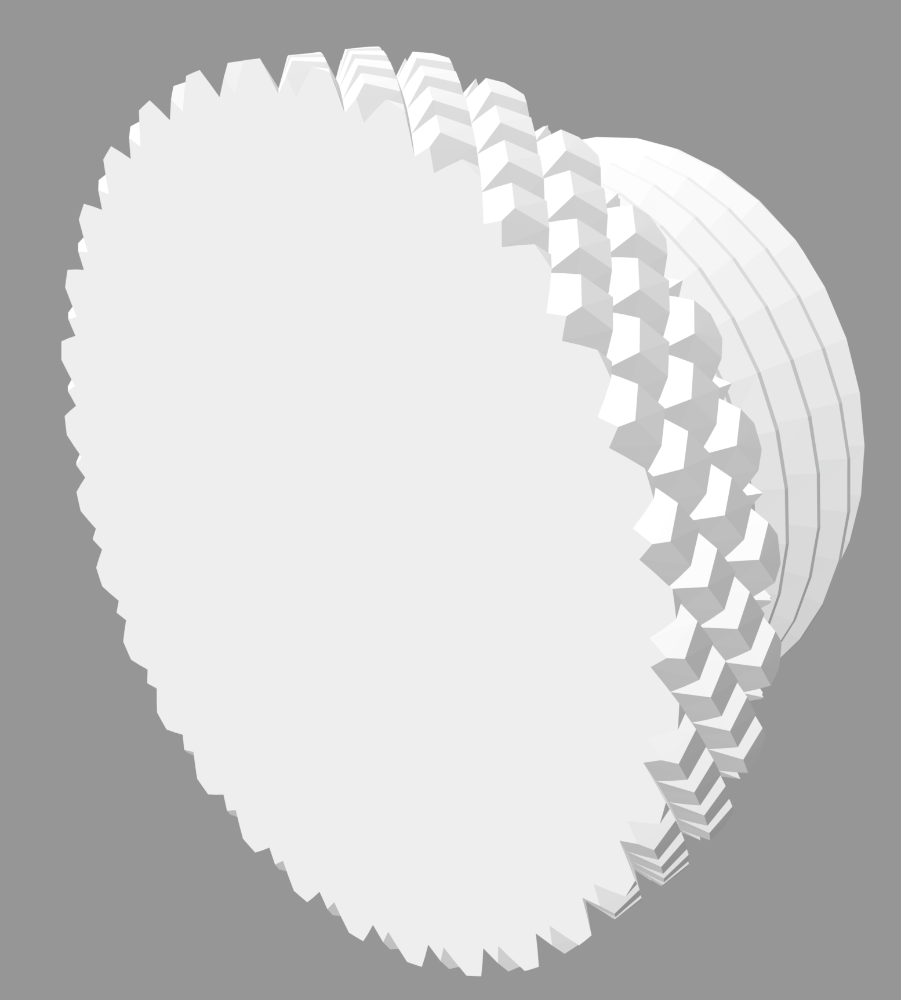{: style="display: block; margin: 0 auto; width: 300px;"}|[Closed cap STL File](./print_files/caps/Cap_Closed.stl)|This can close off any unused openings in the orb housing.|
|Open Cap|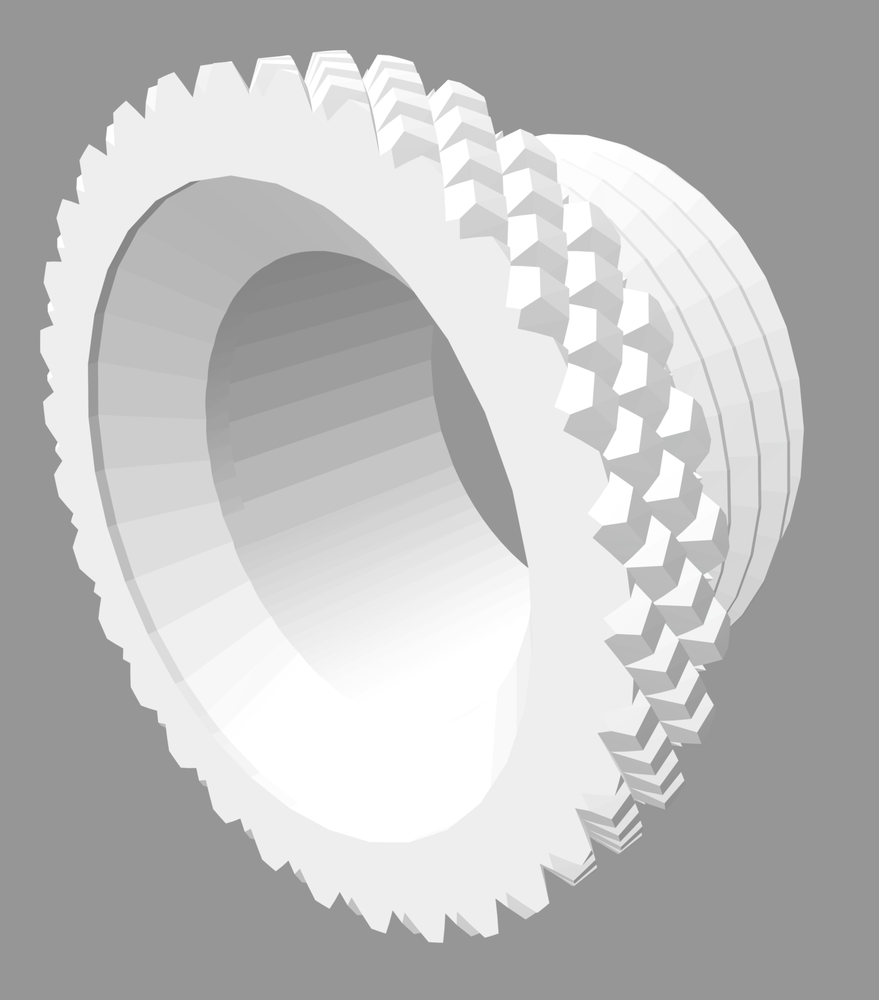{: style="display: block; margin: 0 auto; width: 300px;"}|[Open cap STL File](./print_files/caps/Cap_Open.stl)| This allows passage of external wiring into the orb housing.|
|PVC Adapter|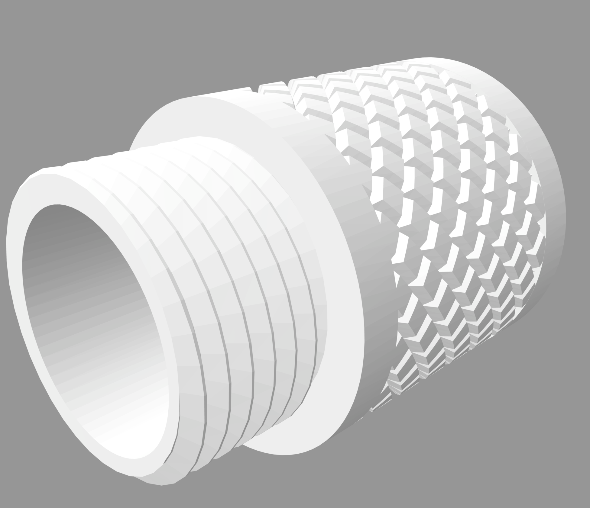{: style="display: block; margin: 0 auto; width: 300px;"}|[Threading to PVC adapter STL File](./print_files/caps/Adapter.stl)|This allows the orb housing to be attached to PVC pipe, which can help with running wires and field set up.|
|Vented Cap|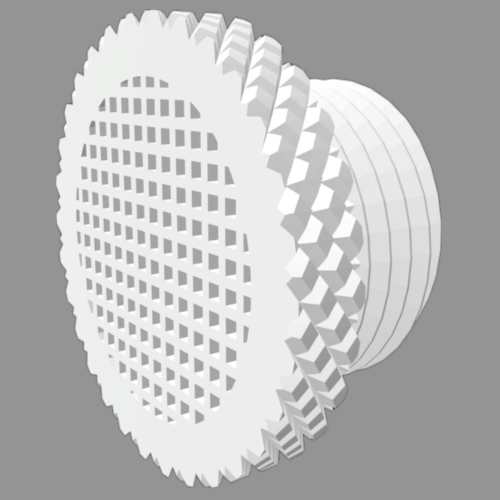{: style="display: block; margin: 0 auto; width: 300px;"}|[Vented Cap STL File](./print_files/caps/Cap_Vent.stl)|This is helpful for anywhere that may overheat, especially the opening at the bottom of the radiation shield.|

Note: Not all key accessories may be necessary for your weather station and you may need more than one of some accessories. This will depend of your specific weather station design.